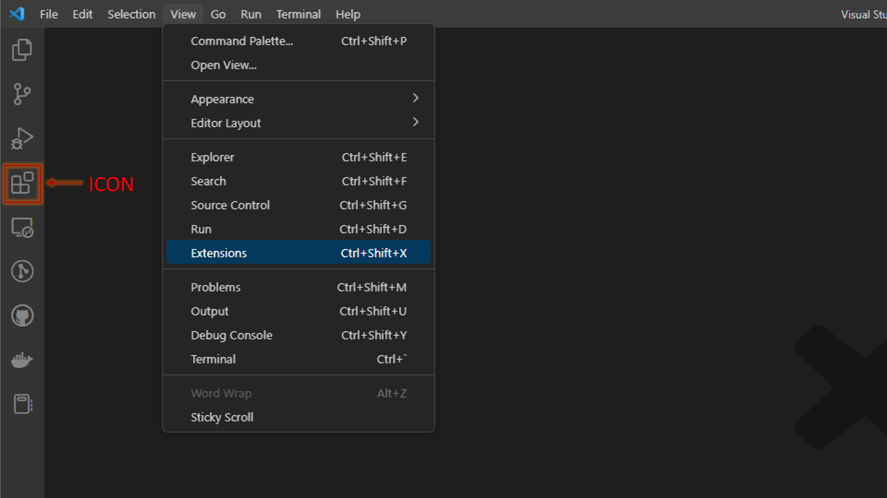
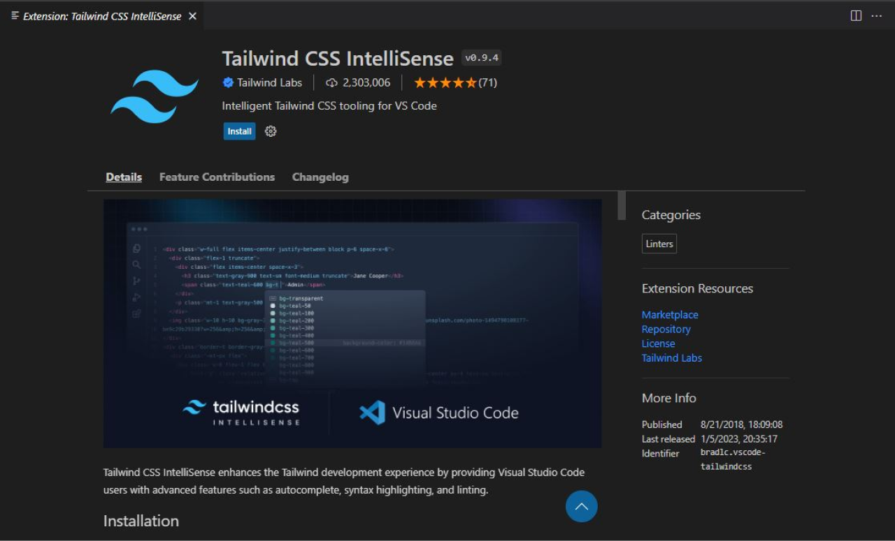
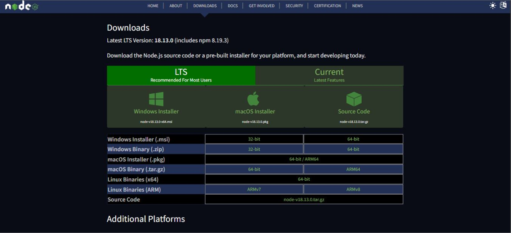
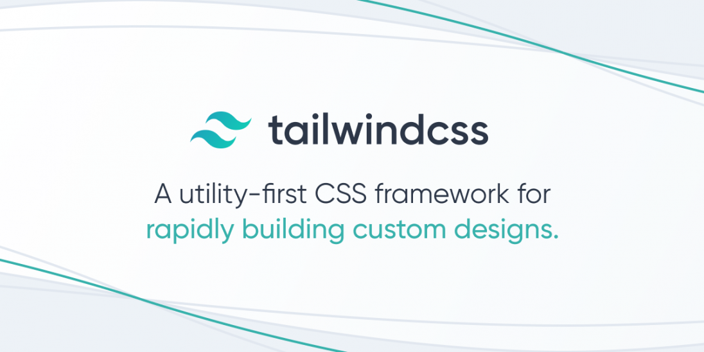

## **Setting up Development Environment.**

1.  ### **Install & setup `VS code` on your PC or laptop.**

    1.  Download VS code according to your OS. You can find the relevant package/executable <a href="https://code.visualstudio.com/download" target="_blank">here</a>.
    <figure markdown>
    
    </figure>
    <small>Optional read - How to install VS code on your PC: <a href="https://code.visualstudio.com/docs/setup/setup-overview" target="_blank">https://code.visualstudio.com/docs/setup/setup-overview</a></small>  

    2.  After installing open VS code and go ‘Extensions’ tab by clicking the following icon on the left menu or you can find the ‘Extensions’ tab, `Top menu` > `View` > `Extensions`.
    <figure markdown>
    {width="500"}
    </figure>

    3.  In the search box, search for `‘tailwind’` and install the `‘Tailwind CSS IntelliSense’` extension by Tailwind Labs.
    <figure markdown>
    {width="450"}
    </figure>

    4.  Then click 'Install' button to install the extension on your PC. After installing you'll see bellow tab/window.
    <figure markdown>
    {width="700"}
    </figure>

2.  ### **Install the `node` on your development PC or laptop.**

    1.  Download node according to your OS. You can find the relevant package/executable <a href="https://nodejs.org/en/download/" target="_blank">here</a>.
    <figure markdown>
    
    </figure>
    <small> Optional read - How to install node on your PC: <a href="https://radixweb.com/blog/installing-npm-and-nodejs-on-windows-and-mac" target="_blank">https://radixweb.com/blog/installing-npm-and-nodejs-on-windows-and-mac</a></small> 

    !!! warning "Open terminal and type the following command to confirm everything has been installed correctly. `‘npm -v’`"
    <figure markdown>
    {width="600"}
    </figure>

3.  ### **Install `git` on your PC or laptop.**

    <figure markdown>
    {width="500"}
    </figure>

    1.  Download the git according to your OS. You can find the relevant package/executable here:  
          Windows: <a href="https://git-scm.com/download/win" target="_blank">https://git-scm.com/download/win</a>
          Linux: <a href="https://git-scm.com/download/linux" target="_blank">https://git-scm.com/download/linux</a>
          Mac: <a href="https://git-scm.com/download/mac" target="_blank">https://git-scm.com/download/mac</a>
          <small> Optional read - How to install node on your PC: <a href="https://radixweb.com/blog/installing-npm-and-nodejs-on-windows-and-mac" target="_blank">https://radixweb.com/blog/installing-npm-and-nodejs-on-windows-and-mac</a></small> 

    !!! warning "Open terminal and type the following command to confirm everything has been installed correctly. `‘git --version’`"
    <figure markdown>
    {width="600"}
    </figure>

## **React & Next Js**

<figure markdown>
{width="700"}
</figure>

-   ### **About Next**

    Next.js is an open-source web development framework created by Vercel enabling React-based web applications with server-side rendering and generating static websites.
      Read more - <a href="https://en.wikipedia.org/wiki/Next.js" target="_blank">https://en.wikipedia.org/wiki/Next.js</a>
     Documentation - <a href="https://nextjs.org/" target="_blank">https://nextjs.org/</a>

-   ### **React vs. Next js, what are the differences?**

    React is one of the most used front-end libraries, allowing developers to create reusable UI components, maintained by Facebook. React is an easy-to-use front-end library that offers various useful tools to enclose routing and state management patterns alongside Redux and other libraries. React is a JavaScript library that allows developers to build user interfaces. A user interface (UI) is a combination of HTML and JavaScript that contains all of the logic needed to display a tiny piece of a bigger UI.  Next, JS is a JavaScript framework that allows developers to create user-friendly and blazing-fast static websites and static web applications with React. Next, JS is an open-source, lightweight web development framework for React applications. It allows developers to build server-side rendering.

     Read more - <a href="https://radixweb.com/blog/nextjs-vs-react" target="_blank">https://radixweb.com/blog/nextjs-vs-react</a>

-   ### **What are the main areas of next js & react that you need to know to contribute to this project?**

    -   **Hooks**

        | Name           | References                                                                                                                              |
        | -------------- | --------------------------------------------------------------------------------------------------------------------------------------- |
        | `useState();`  | <a href="https://reactjs.org/docs/hooks-state.html" target="_blank">https://reactjs.org/docs/hooks-state.html</a>                       |
        | `useEffect();` | <a href="https://reactjs.org/docs/hooks-effect.htm" target="_blank">https://reactjs.org/docs/hooks-effect.html</a>                      |
        | `useRef();`    | <a href="https://reactjs.org/docs/hooks-reference.html#useref" target="_blank">https://reactjs.org/docs/hooks-reference.html#useref</a> |
        | `useRouter();` | <a href="https://nextjs.org/docs/api-reference/next/router" target="_blank">https://nextjs.org/docs/api-reference/next/router</a>       |

    -   **SSR & SSG**

        | Name                         | References                                                                                                                                                          |
        | ---------------------------- | ------------------------------------------------------------------------------------------------------------------------------------------------------------------- |
        | SSR (Server Side Rendering)  | <a href="https://nextjs.org/docs/basic-features/pages#server-side-rendering" target="_blank">https://nextjs.org/docs/basic-features/pages#server-side-rendering</a> |
        | SSG (Server Side Generation) | <a href="https://nextjs.org/docs/basic-features/pages#static-generation" target="_blank">https://nextjs.org/docs/basic-featurespages#static-generation</a>          |

    -   **Data fetching with next**

        | Method                            | References                                                                                                                                                                                                |
        | --------------------------------- | --------------------------------------------------------------------------------------------------------------------------------------------------------------------------------------------------------- |
        | `getServerSideProps();`           | <a href="https://nextjs.org/docs/basic-features/data-fetching/get-server-side-props" target="_blank">https://nextjs.org/docs/basic-features/data-fetching/get-server-side-props</a>                       |
        | `getStaticPaths();`               | <a href="https://nextjs.org/docs/basic-features/data-fetching/get-static-path" target="_blank">https://nextjs.org/docs/basic-features/data-fetching/get-static-path</a>                                   |
        | `getStaticProps();`               | <a href="https://nextjs.org/docs/basic-features/data-fetching/get-static-props" target="_blank">https://nextjs.org/docs/basic-features/data-fetching/get-static-props</a>                                 |
        | `Incremental Static Regeneration` | <a href=" https://nextjs.org/docs/basic-features/data-fetching/incremental-static-regeneration" target="_blank"> https://nextjs.org/docs/basic-features/data-fetching/incremental-static-regeneration</a> |
        | `Client-side data fetching`       | <a href="https://nextjs.org/docs/basic-features/data-fetching/client-side" target="_blank">https://nextjs.org/docs/basic-features/data-fetching/client-side</a>                                           |

## **Tailwind CSS**

<figure markdown>

</figure>

-   ### **About Tailwind**

    Tailwind CSS is an open-source CSS framework. The main feature of this library is that, unlike other CSS frameworks like Bootstrap, it does not provide a series of predefined classes for elements such as buttons or tables.
      Read more - <a href="https://en.wikipedia.org/wiki/Tailwind_CSS" target="_blank">https://en.wikipedia.org/wiki/Tailwind_CSS</a>
     Documentation - <a href="https://tailwindcss.com/" target="_blank">https://tailwindcss.com/</a>
     UI library - <a href="https://tailwindui.com/" target="_blank">https://tailwindui.com/</a>

<small>image credits goes to respective owners</small>
