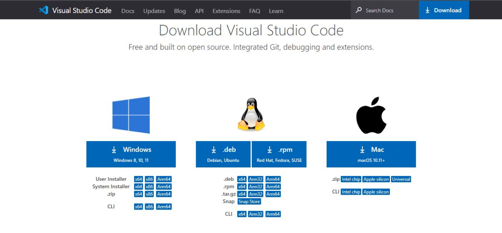
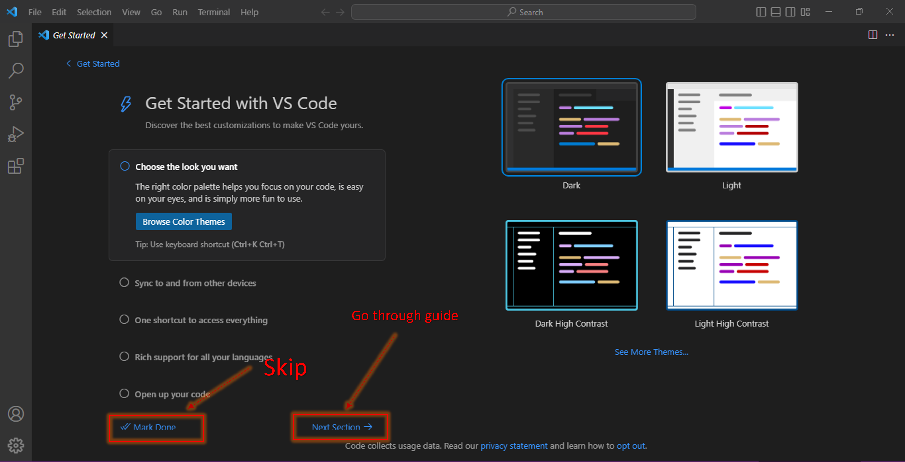
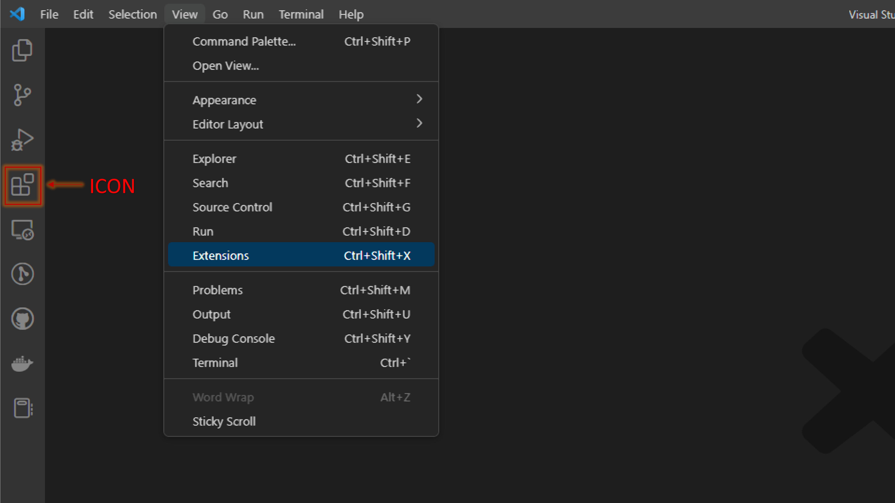
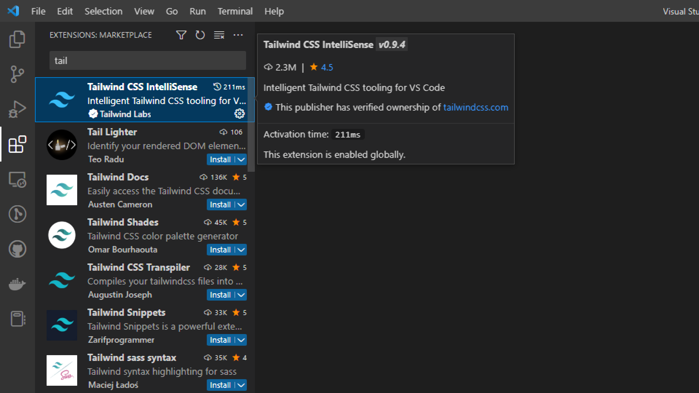
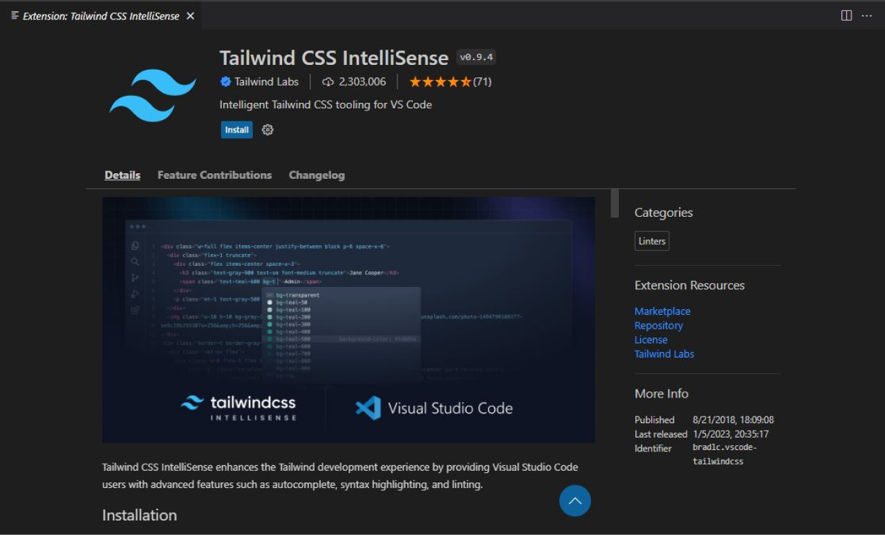
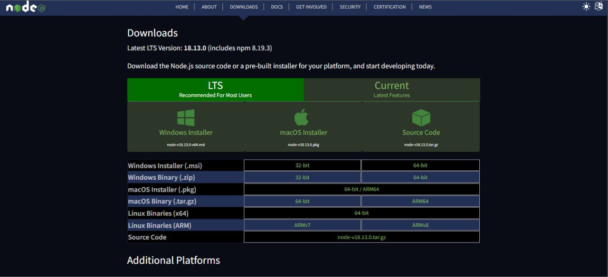
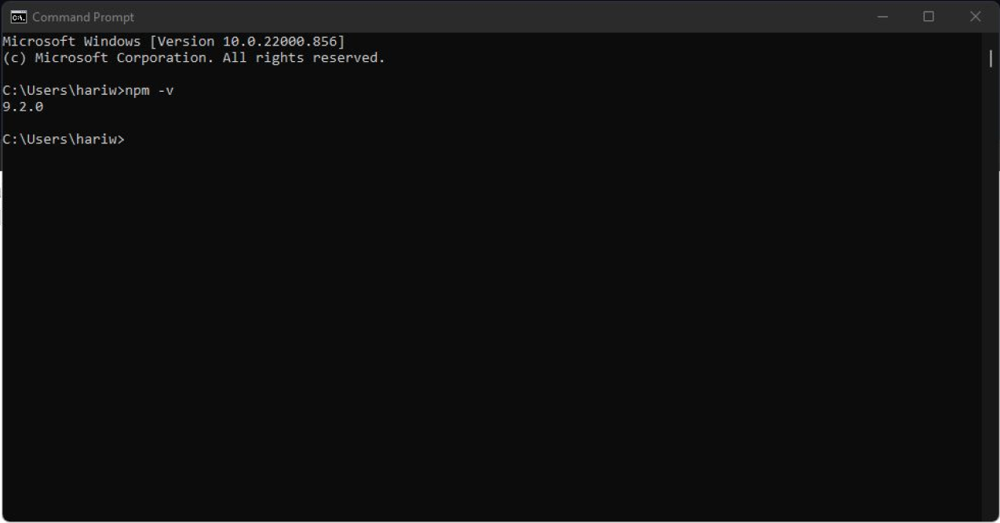
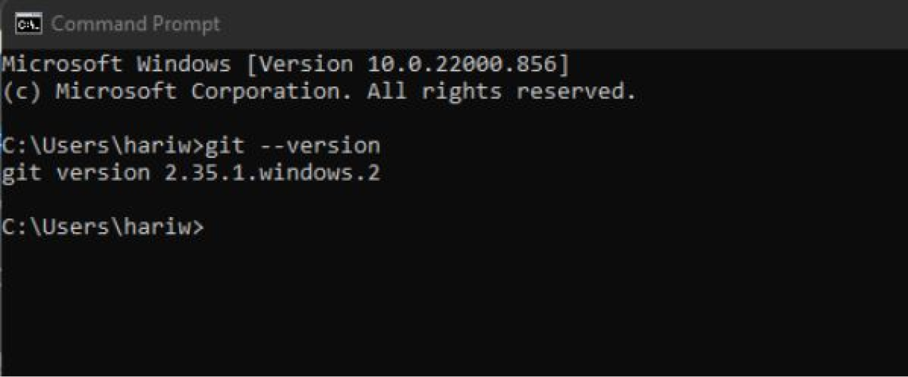

# Chapter 1: Development Environment

1.  ### **Install & setup `VS code` on your PC or laptop.**

    1.  Download VS code according to your OS. You can find the relevant package/executable <a href="https://code.visualstudio.com/download" target="_blank">here</a>.
    <figure markdown>
    
    </figure>
    <!-- <small>Optional read - How to install VS code on your PC: <a href="https://code.visualstudio.com/docs/setup/setup-overview" target="_blank">https://code.visualstudio.com/docs/setup/setup-overview</a></small> -->
    **How to install:**
      Windows: <a href="https://code.visualstudio.com/docs/setup/windows" target="_blank">https://code.visualstudio.com/docs/setup/windows</a>
      Linux: <a href="https://code.visualstudio.com/docs/setup/linux" target="_blank">https://code.visualstudio.com/docs/setup/linux</a>
      Mac: <a href="https://code.visualstudio.com/docs/setup/mac" target="_blank">https://code.visualstudio.com/docs/setup/mac</a>

      

    2.  After installing `VS Code`, Open it. If you open `VS Code` for the first time, you'll get the following screen. Here you can see some configuration settings(Ex - theme) and a quick setup guide. You can go through this guide if you're new to `VS Code` or can simply click "Mark Done" to skip these steps.
    <figure markdown>
    
    </figure>

    3.  After opening `VS Code`, go ‘Extensions’ tab by clicking the following icon on the left menu or you can find the ‘Extensions’ tab, `Top menu` > `View` > `Extensions`.
    <figure markdown>
    
    </figure>

    4.  In the search box, search for `‘tailwind’` and install the `‘Tailwind CSS IntelliSense’` extension by Tailwind Labs.
    <figure markdown>
    
    </figure>

    5.  Then click 'Install' button to install the extension on your PC. After installing you'll see bellow tab/window.
    <figure markdown>
    
    </figure>

2.  ### **Install the `node` on your development PC or laptop.**

    1.  Download node according to your OS. You can find the relevant package/executable <a href="https://nodejs.org/en/download/" target="_blank">here</a>.
    <figure markdown>
    
    </figure>
    <!-- <small> Optional read - How to install node on your PC: <a href="https://radixweb.com/blog/installing-npm-and-nodejs-on-windows-and-mac" target="_blank">https://radixweb.com/blog/installing-npm-and-nodejs-on-windows-and-mac</a></small>  -->
    **How to install:**
      Windows, Linux, Mac: <a href="https://kinsta.com/blog/how-to-install-node-js/" target="_blank">https://kinsta.com/blog/how-to-install-node-js/</a>

    !!! warning "Open terminal and type the following command to confirm everything has been installed correctly. `‘npm -v’`"
    <figure markdown>
    
    </figure>

3.  ### **Install `git` on your PC or laptop.**

    <figure markdown>
    
    </figure>

    1.  Download the git according to your OS. You can find the relevant package/executable here:  
          Windows: <a href="https://git-scm.com/download/win" target="_blank">https://git-scm.com/download/win</a>
          Linux: <a href="https://git-scm.com/download/linux" target="_blank">https://git-scm.com/download/linux</a>
          Mac: <a href="https://git-scm.com/download/mac" target="_blank">https://git-scm.com/download/mac</a>  
        <!--   <small> Optional read - How to install node on your PC: <a href="https://radixweb.com/blog/installing-npm-and-nodejs-on-windows-and-mac" target="_blank">https://radixweb.com/blog/installing-npm-and-nodejs-on-windows-and-mac</a></small>  -->
        **How to install:**
          Windows, Linux, Mac: <a href="https://www.atlassian.com/git/tutorials/install-git" target="_blank">https://www.atlassian.com/git/tutorials/install-git</a>

    !!! warning "Open terminal and type the following command to confirm everything has been installed correctly. `‘git --version’`"
    <figure markdown>
    
    </figure>
