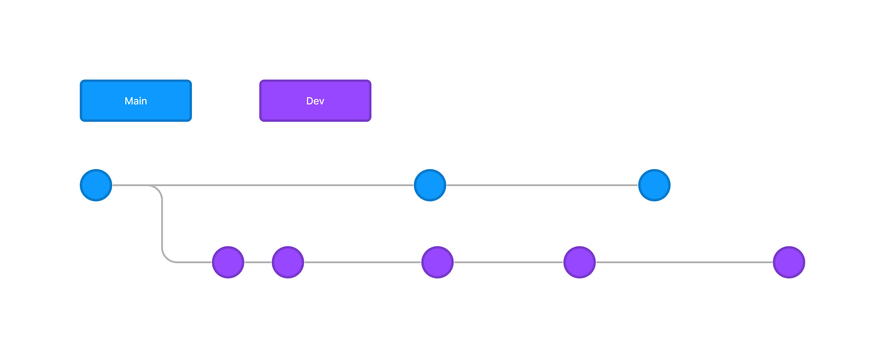
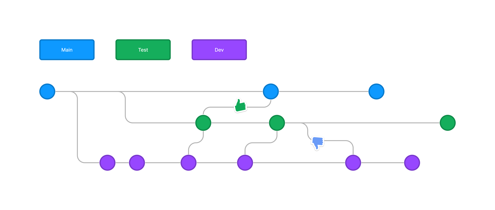
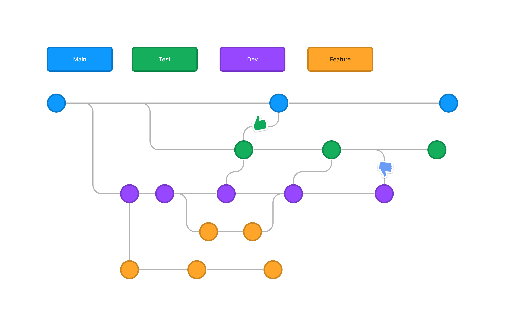

# Chapter 2: Git Workflow

The core idea behind this branch workflow is to follow an easy process to be able to test the code before push it to the production.
This will help multiple developers to work on the project easily without disturbing the main codebase. It also means the `main` branch will never contain broken code, which is a huge advantage for CI/CD environments.

!!! info "Important!" 
    - We're planning to use the same repository when contributing to the code, which means we're not going to use <a href="https://www.atlassian.com/git/tutorials/comparing-workflows/forking-workflow" target="_blank">`Forking Workflow`</a>. 
    - This will help us to code efficiently and to deliver features much more faster.

## Getting Started

In a nutshell, We will have 3 main type of branches called `main`,`dev` & `test`. And also, as usual we will use feature branches to develop features & hotfix branches to fix bugs.

## How it works
Instead of a single `main` branch, this workflow uses three branches to record the history of the project and to test the project before production. The `main` branch stores the official release history.

### Development Branch
The development (`dev`) branch serves as an integration branch for features.
<figure markdown>
  {width="800"}
  <figcaption>Example: Dev branch</figcaption>
</figure>
The first step is to complement the default `main` with a `dev` branch. A simple way to do this is for one developer to create an empty `dev` branch locally and push it to the server. But most of the time this is done by creating the `dev` branch from the `main` branch.
```
git checkout -b dev
```
!!! warning "Beware"
    Usually above step is done at the project initialization, Therefore you don't have to worry about it in `Bitzquad Academy` project.


### Test Branch
The `test` branch carries manual testings before production. 
<figure markdown>
  {width="800"}
  <figcaption>Example: Test branch</figcaption>
</figure>
The idea behind `test` branch is to test code changes efficiently without disturbing to developers to carry out their job. This will help testers to manually test the feature while developers are working on other tasks. Usually features are delivered to the `test` branch by using a PR.

-   If the delivered feature is production ready 👍, Then it will be merged to the `main` branch by using a PR. 
-   If it needs more changes 👎, Testers will ask developers for changes 😈. Changes will be merged to the `dev` branch again using a PR when its fixed. 

### Feature Branches
<figure markdown>
  {width="800"}
  <figcaption>Example: Feature branches</figcaption>
</figure>

The core idea behind the Feature Branch Workflow is that all feature development should take place in a dedicated branch instead of the main branch. This encapsulation makes it easy for multiple developers to work on a particular feature without disturbing the main codebase. A developer can work on a new feature branch until the particular feature is complete. 

##### Start with the main branch.
All feature branches are created off the latest code state of a project. This guide assumes this is maintained and updated in the main branch.
!!! warning "Beware"
    This can be changed on some occasions like when one feature depends on another part that has not yet been developed or is in under development stage.
    In that kind of scenario, You'll have to start with the `dev` branch.

#### Feature branch naming conventions.