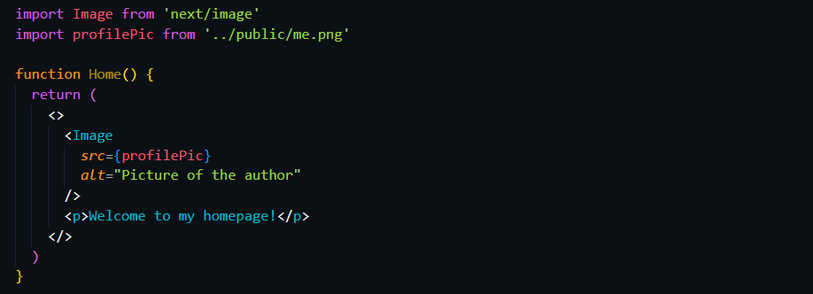

# NEXT / Image

## Introduction

The Next.js Image component, `[next/image](https://nextjs.org/docs/api-reference/next/image)`, is an extension of the HTML `` element, evolved for the modern web. It includes a variety of built-in performance optimizations to help you achieve good [Core Web Vitals](https://nextjs.org/learn/seo/web-performance).

~Next.js Docs

## ********Built in optimizations of Next/Image********

- Improved Performance
- Visual Stability
- Faster Page Loads
- Asset Flexibility

## Using Next/Image

### Installation

Next/Image comes preinstalled when you create a next.js project. There’s no need to install it separately.

### Importing into project

The Next/Image component can be imported into a page as follows.

`import Image from 'next/image'`

### Required Props

The `Image` component requires 4 props to work. They are,

1. src
2. width
3. height
4. alt

### **src**

The `src` props accepts,

1. Statically imported images
2. Image string path
1. **Statically imported images**
    
    **Importing the static image**
    
    `import profilePic from '../public/me.png'`
    
    **Use the imported image in a page**
    
    
    
    <aside>
    💡 The width and height attributes will be automatically determined by next.js based on the imported image.
    
    </aside>
    
2. **Image string path**
    
    <aside>
    ⚠️ Next/Image component supports `.jpg`, `.png`, or `.webp`  files
    
    </aside>
    
    - **Local path string**
        
        The local string path to a image can be provided as follows.
        
        
        
    - **External path string**
        
        When a external image path is provided to the src prop, it will throw an error when compiling as shown below.
        
        
        
        To use a external image, the domain should be configured in `next.config.js` as a remote pattern.
        
        
        
        <aside>
        ⚠️ Make sure to restart application when you change the `next.config.js` file.
        
        </aside>
        
        Final code
        
        
        

### **width**

Sets the width of the image in pixels (px)

### **height**

Sets the height of the image in pixels (px)

### **alt**

Sets the alt text for the image.

## Read more

Read more details on Next/Image component in [Next.js Docs](https://nextjs.org/docs/api-reference/next/image)