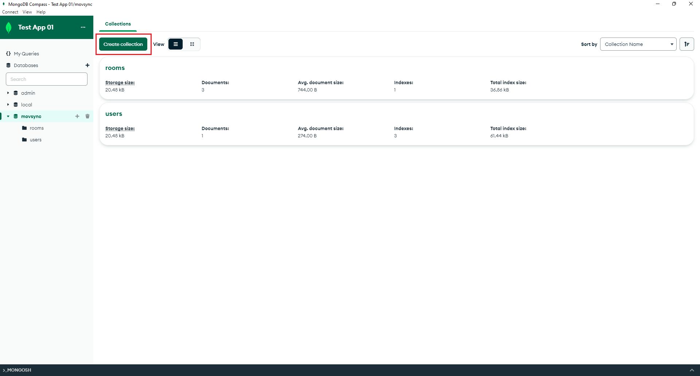
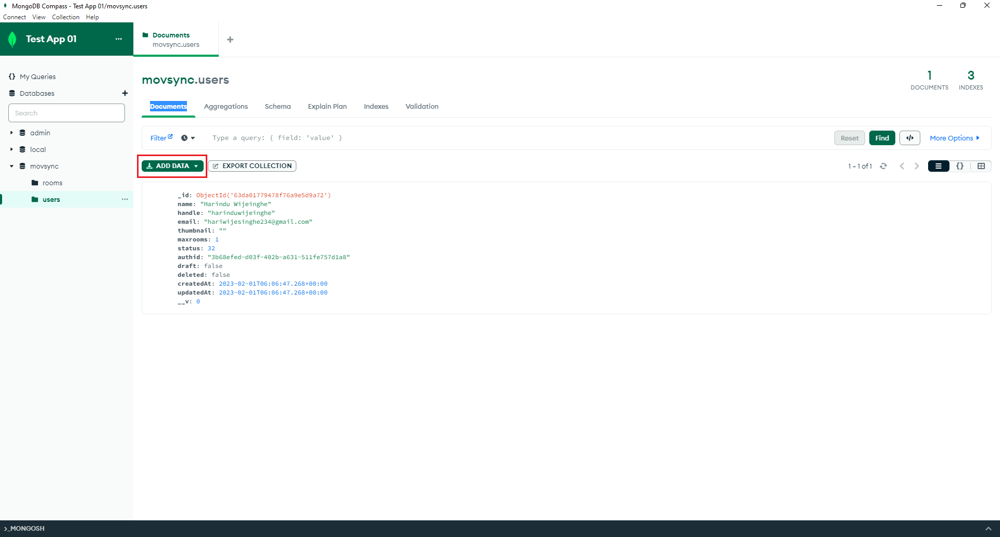

_Updated on_ `15/01/2023` _by_ `Isuru Harischandra`

# Creating a MongoDB database cluster and retrieving URI

Now you are going to set up a MongoDB cluster to connect to your local application setup. To connect the MongoDB cluster with your application, you need to get the URI of the MongoDB cluster that you are going to create. Let's see how to create a MongoDB cluster instance from scratch and get the URI.

## Create a new MongoDB account

-   Go to [mongoDB login](https://account.mongodb.com/account/login?signedOut=true)
-   Click on signup with google and choose your google account.

<figure markdown>
  <kbd></kbd>
</figure>

-   Put a tick in the checkbox provided and accept the privacy policy & terms of service.

<figure markdown>
  <kbd></kbd>
</figure>

## Add your IP address

-   You will be redirected to the database deployments page. Add your IP address to the **allowed list**.

<figure markdown>
  <kbd></kbd>
</figure>

!!! info "Important!" - Each database deployed in MongoDB requires an allowed list of IP addresses to establish a secure connection between host machines and the MongoDB cluster.

-   You will see a pop-up notice saying that your IP address has been added to the allowed list successfully.

<figure markdown>
  <kbd></kbd>
</figure>

-   You can visit the network access page and confirm whether your IP address has been added to the allowed list properly.

<figure markdown>
  <kbd></kbd>
</figure>

## Creating a new project

!!! info "Important!" - With your MongoDB account, you can create and manage multiple projects.

-   Your very first project will be created by MongoDB as **Project 0**. Let's rename the project name as **Bitzquad Academy - Local**. (or you can create a new project)

<figure markdown>
  <kbd></kbd>
</figure>

<figure markdown>
  <kbd></kbd>
</figure>

<figure markdown>
  <kbd></kbd>
</figure>

<figure markdown>
  <kbd>{width="400"}</kbd>
</figure>

## Creating a database cluster

-   Let's get back to the database deployments page and build a new database.

<figure markdown>
  <kbd></kbd>
</figure>

-   It will ask for a suitable deployment plan. Let's select **free - shared cloud database** since it will cover our requirements.

<figure markdown>
  <kbd></kbd>
</figure>

<figure markdown>
  <kbd></kbd>
</figure>

-   Then you need to select a particular cloud provider and a server to host the cloud database. Let's go on with **AWS** as the cloud provider and **Singapore (ap-southeast-1)** as the server.

<figure markdown>
  <kbd>{width="600"}</kbd>
</figure>

!!! warning "Important!" - Mainly, we should focus on selecting a server placed in a nearby region for us to minimize the latency that occurs during request and response times. - MongoDB will suggest some servers were placed in Recommended regions for us.

-   Make sure that you have selected **M0 Sandbox** as the **Cluster Tier**.

<figure markdown>
  <kbd>{width="600"}</kbd>
</figure>

-   No need to change **Additional Settings** here. Leave the default settings as it is.

<figure markdown>
  <kbd>{width="600"}</kbd>
</figure>

!!! info "Important!" - You can configure **Backup** plans only for paid clusters. - **Termination Protection** will help us to prevent any users from accidentally deleting the cluster. - Since you are the only person who uses this cluster (for the development of the application) there's no need for termination protection at all.

-   Your default **Cluster Name** will be **Cluster0**. You can change it if you like.

<figure markdown>
  <kbd>{width="600"}</kbd>
</figure>

!!! danger "Important!" - Be aware that once your cluster has been created, you won't be able to change its name.

-   Let's create the cluster.

<figure markdown>
  <kbd></kbd>
</figure>
 
## Database connection configuration

-   It will redirect you to the **Security Quickstart** page. Here, you can configure the necessary settings to authenticate your database connection. Select **Username and Password** as the authentication. Enter a proper **Username** and a **Password**.

<figure markdown>
  <kbd>{width="600"}</kbd>
</figure>

!!! info "Important!" - You can save your credentials in a password manager for better protection and in case of an emergency.

-   After setting up credentials, you can create a user. You need these credentials to set up a secure connection to the database cluster.

<figure markdown>
  <kbd>{width="600"}</kbd>
</figure>

-   Then you need to select, from where you connect to the database. Since you are setting up the application in your local environment, you should select **My Local Environment**.

<figure markdown>
  <kbd>{width="600"}</kbd>
</figure>

-   After that, you have to include the IP addresses of all the allowed host machines that should be connected to our database (in this case, your local machine).

<figure markdown>
  <kbd>{width="600"}</kbd>
</figure>

!!! danger "Important!" - The IP address we added (112.134.170.82) is valid only for now. - It will change every time when we connect to the network. - By adding **0.0.0.0** to the allowed list, we can get access to the database even if our IP address is changed.

!!! info "Important!" - You can check whether your IP address has been added to the allowed list as mentioned here. - If so, you are good to Finish and Close the process. - Don't forget to add **0.0.0.0** also to the allowed list.

-   Let's view your newly created database cluster.

<figure markdown>
  <kbd></kbd>
</figure>
 
## Retrieving connection URI

-   You will be redirected to the **Database Deployments** page again. You can see that your newly created database cluster has been deployed successfully. Let’s connect your database cluster to the application. Click on **Connect**.

<figure markdown>
  <kbd></kbd>
</figure>

-   Then you need to select the connection method. Since you are going to connect to your database from an application, select **Connect your application**.

<figure markdown>
  <kbd>{width="600"}</kbd>
</figure>

-   We use MongoDB drivers to connect our app with our database cluster. The driver we use depends on our application. Since the backend of our project is written in NodeJS, you need to use the NodeJS MongoDB Driver. Make sure to select the appropriate NodeJS version you have installed.

<figure markdown>
  <kbd>{width="600"}</kbd>
</figure>

!!! info "Important!" - Run this command in a terminal to find the nodeJS version installed in your computer.

```sh
node -v
```

!!! info "Important!" - Click [here](https://nodejs.org/en/download/) to install nodeJS if you have not installed it yet.

-   Now you can simply copy the URI by clicking on the **Copy** icon. Before pasting the URI in your application code, make sure to replace **<password>** in the URI with the actual password you provided for the relevant user created earlier.

<figure markdown>
  <kbd>{width="600"}</kbd>
</figure>

## MongoDB Compass (Optional)

MongoDB Compass is a GUI tool for MongoDB. It is a cross-platform application that allows you to connect to your MongoDB database and perform various operations on it.
We recommend you to use MongoDB Compass to access your database cluster during the development phase of the project.

-   _Expected benifits of using MongoDB Compass are as follows._

    -   You can save time by using the GUI tool.
    -   You can view the data in your database in a more readable format.
    -   You can perform CRUD operations on your database.
    -   You can view the structure of your database.
    -   You can view the logs of your database.

-   _How to get MongoDB Compass?_

    -   You can download MongoDB Compass from [here](https://www.mongodb.com/try/download/compass).
    <figure markdown>
      <kbd>{width="600"}</kbd>
    </figure>
    <sub>Select the appropriate latest stable version for your operating system and download it.</sub>

    -   After downloading, run the downloaded file and install MongoDB Compass. (You can follow the installation steps [here](https://docs.mongodb.com/compass/master/install/).)
    <figure markdown>
      <kbd>{width="600"}</kbd>
    </figure>
    <sub>After running the downloaded file, you will see the installation wizard. Wait until the installation is completed.</sub>

    -   After the installation is completed, it will automatically open the MongoDB Compass. If not, you can open it from the start menu. You can see the following screen.
    <figure markdown>
      <kbd></kbd>
    </figure>
        Close the welcome screen and click on **New connection**.

    -   Then you need to provide the connection details. You can find the connection details in the **Connect** tab of your database cluster. You can see the following screen. Copy the connection URI and paste it in the **Connection String Only** field in MongoDB Compass. Then click on **Save and Connect**.
    <figure markdown>
    <kbd></kbd>
    </figure>

    -   Then it will ask a name for the connection. You can give any name you want. Then click on **Save & Connect**.
    <figure markdown>
    <kbd></kbd>
    </figure>

    -   When the connection is established, you can see the following screen. You can see the databases in your database cluster in the left side of the screen. You can see the collections in the selected database in the middle of the screen. You can see the data in the selected collection in the right side of the screen.
    <figure markdown>
    <kbd></kbd>
    </figure>

    -   There is a tab called **Databases** in the top middle of the screen. You can click on it to view the databases in your database cluster. In here you can see some information about the databases. You can also create a new database by clicking on the **Create Database** button.
    <figure markdown>
    <kbd></kbd>
    </figure>

    -   When you open a database, you can see the collections in the database in the middle of the screen. You can also create a new collection by clicking on the **Create Collection** button.
    <figure markdown>
     <kbd></kbd>
    </figure>

    -   When you open a collection, you can see the data in the collection in the right side of the screen. You can also create a new document by clicking on the **Add data** button.
    <figure markdown>
    <kbd></kbd>
    </figure>

# Read More

Read more details about [MongoDB Compass](https://docs.mongodb.com/compass/master/).
