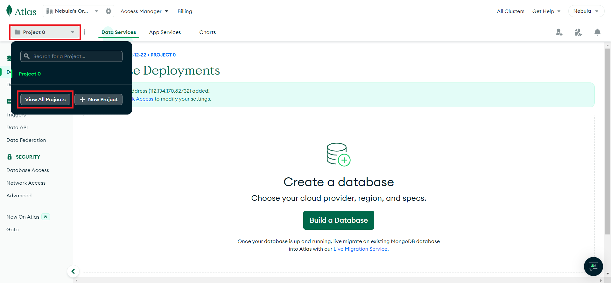

*Updated on* `25/12/2022` *by* `Isuru Harischandra` 

# Creating a MongoDB database cluster and retrieving URI

Now you are going to set up a MongoDB cluster to connect to your local application setup. To connect the MongoDB cluster with your application, you need to get the URI of the MongoDB cluster that you are going to create. Let's see how to create a MongoDB cluster instance from scratch and get the URI.

## Create a new MongoDB account

- Go to [mongoDB login](https://account.mongodb.com/account/login?signedOut=true)
- Click on signup with google and choose your google account. 

<figure markdown>
  <kbd></kbd>
</figure>

- Put a tick in the checkbox provided and accept the privacy policy & terms of service.

<figure markdown>
  <kbd></kbd>
</figure>

## Add your IP address

- You will be redirected to the database deployments page. Add your IP address to the **allowed list**. 

<figure markdown>
  <kbd></kbd>
</figure>

!!! info "Important!"
    - Each database deployed in MongoDB requires an allowed list of IP addresses to establish a secure connection between host machines and the MongoDB cluster.  

- You will see a pop-up notice saying that your IP address has been added to the allowed list successfully. 

<figure markdown>
  <kbd></kbd>
</figure>

- You can visit the network access page and confirm whether your IP address has been added to the allowed list properly. 

<figure markdown>
  <kbd></kbd>
</figure>

## Creating a new project

!!! info "Important!"
    - With your MongoDB account, you can create and manage multiple projects.

- Your very first project will be created by MongoDB as **Project 0**. Let's rename the project name as **Bitzquad Academy - Local**. (or you can create a new project) 
 
<figure markdown>
  <kbd></kbd>
</figure>

<figure markdown>
  <kbd></kbd>
</figure>

<figure markdown>
  <kbd></kbd>
</figure>

<figure markdown>
  <kbd>{width="400"}</kbd>
</figure>

## Creating a database cluster

- Let's get back to the database deployments page and build a new database. 

<figure markdown>
  <kbd></kbd>
</figure>

- It will ask for a suitable deployment plan. Let's select **free - shared cloud database** since it will cover our requirements. 

<figure markdown>
  <kbd></kbd>
</figure>

<figure markdown>
  <kbd></kbd>
</figure>

- Then you need to select a particular cloud provider and a server to host the cloud database. Let's go on with **AWS** as the cloud provider and **Singapore (ap-southeast-1)** as the server. 

<figure markdown>
  <kbd>{width="600"}</kbd>
</figure>

!!! warning "Important!"
    - Mainly, we should focus on selecting a server placed in a nearby region for us to minimize the latency that occurs during request and response times. 
    - MongoDB will suggest some servers were placed in Recommended regions for us.

- Make sure that you have selected **M0 Sandbox** as the **Cluster Tier**.

<figure markdown>
  <kbd>{width="600"}</kbd>
</figure>

- No need to change **Additional Settings** here. Leave the default settings as it is.

<figure markdown>
  <kbd>{width="600"}</kbd>
</figure>

!!! info "Important!"
    - You can configure **Backup** plans only for paid clusters. 
    - **Termination Protection** will help us to prevent any users from accidentally deleting the cluster. 
    - Since you are the only person who uses this cluster (for the development of the application) there's no need for termination protection at all.

- Your default **Cluster Name** will be **Cluster0**. You can change it if you like.

<figure markdown>
  <kbd>{width="600"}</kbd>
</figure>

!!! danger "Important!"
    - Be aware that once your cluster has been created, you won't be able to change its name.

- Let's create the cluster. 

<figure markdown>
  <kbd></kbd>
</figure>
 
## Database connection configuration

- It will redirect you to the **Security Quickstart** page. Here, you can configure the necessary settings to authenticate your database connection. Select **Username and Password** as the authentication. Enter a proper **Username** and a **Password**. 

<figure markdown>
  <kbd>{width="600"}</kbd>
</figure>

!!! info "Important!"
    - You can save your credentials somewhere else, in case of an emergency.

- After setting up credentials, you can create a user. You need these credentials to set up a secure connection to the database cluster. 

<figure markdown>
  <kbd>{width="600"}</kbd>
</figure>

- Then you need to select, from where you connect to the database. Since you are setting up the application in your local environment, you should select **My Local Environment**. 

<figure markdown>
  <kbd>{width="600"}</kbd>
</figure>

- After that, you have to include the IP addresses of all the allowed host machines that should be connected to our database (in this case, your local machine). 

<figure markdown>
  <kbd>{width="600"}</kbd>
</figure>

!!! info "Important!"
    - Since you have already added your IP address in step 4, there’s no need to add the IP address again. 
    - You can check whether your IP address has been added to the allowed list as mentioned here. 
    - If so, you are good to Finish and Close the process.

- Let's view your newly created database cluster. 

<figure markdown>
  <kbd></kbd>
</figure>
 
## Retrieving connection URI

- You will be redirected to the **Database Deployments** page again. You can see that your newly created database cluster has been deployed successfully. Let’s connect your database cluster to the application. Click on **Connect**. 

<figure markdown>
  <kbd></kbd>
</figure>

- Then you need to select the connection method. Since you are going to connect to your database from an application, select **Connect your application**. 

<figure markdown>
  <kbd>{width="600"}</kbd>
</figure>

- We use MongoDB drivers to connect our app with our database cluster. The driver we use depends on our application. Since the backend of our project is written in NodeJS, you need to use the NodeJS MongoDB Driver. Make sure to select the appropriate NodeJS version you have installed. 

<figure markdown>
  <kbd>{width="600"}</kbd>
</figure>

!!! info "Important!"
    - Run this command in a terminal to find the nodeJS version installed in your computer.

```sh
node -v
```

!!! info "Important!"
    - Click [here](https://nodejs.org/en/download/) to install nodeJS if you have not installed it yet.

- Now you can simply copy the URI by clicking on the **Copy** icon. Before pasting the URI in your application code, make sure to replace **<password>** in the URI with the actual password you provided for the relevant user created earlier. 

<figure markdown>
  <kbd>{width="600"}</kbd>
</figure> 