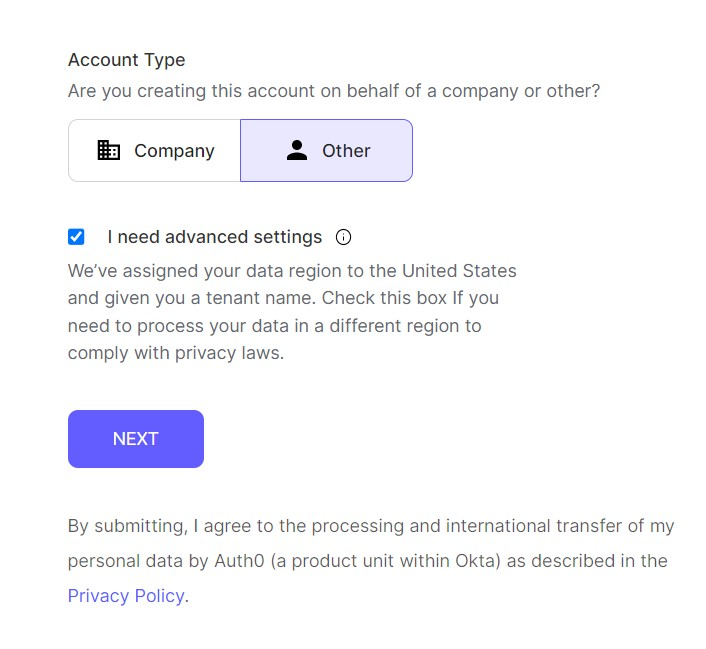
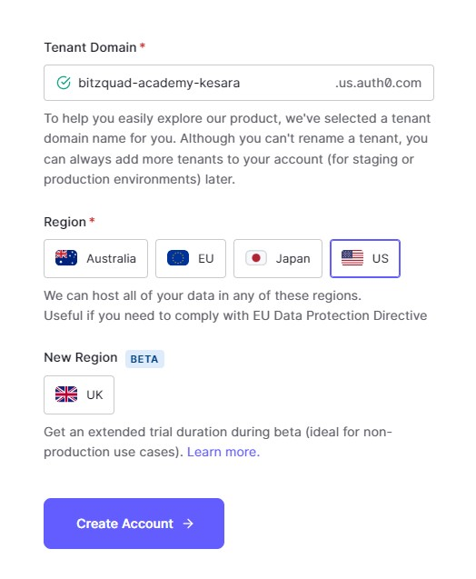

# How to integrate Auth0 to the project.
1. You can create an auth0 account by accessing <a href="https://auth0.com/signup" target="_blank">Auth0 signup page</a> here.
You can use your google account or email to create an account. 
    <figure markdown>
    {width="300"}
    </figure>

2. Then select account type `Other` and `Advanced settings`.

    !!! warning "Important"
        It's better to select `advanced settings` because it will allow you to create a tenant in the next step.

    <figure markdown>
    {width="450"}
    </figure>

3. Change the Tenant Domain to `bitzquad-academy-[your-name].us.auth0.com` & select `US` as the region.

    -  Then Create the account. (This will create a new tenant in your account.)
    <figure markdown>
    {width="450"}
    </figure>

4. After creating the account, you can start following the `5MIN INTRO` by AUTH0.

    !!! info "Don't panic!"
        If you don't see the below screen, You can create an app by using `Applications` tab in the left menu bar.
        <br />- `Applications` -> `Applications` -> `Create Application` 
        <br />- Then choose the `Regular Web Application` option and `NextJS`. 
        <br />- When using this method, `settings` tab will allow you to configure all the following changes.
        <br />- You can jump <a href="#auth0-settings">here</a> to continue the tutorial.

    <figure markdown>
    {width="450"}
    </figure>

5. Next, Select the `Regular Web App` option and `NextJS` to continue.
    <figure markdown>
    {width="450"}
    </figure>
  
    <figure markdown>
    {width="450"}
    </figure>

6. **In step 02**, you can configure the login box.
    <figure markdown>
    {width="450"}
    </figure> 
    -   We recommend you to select `Google/ Gmail`, `Microsoft Account` & `Facebook` social connection options.
    -   You can copy the `Bitzquad Logo` url here. ``` https://www.bitzquad.com/logo.webp ```  
    -   Leave the rest of the settings as it is.

        
7.   As the **3rd step** log into the box that you've configured in the previous step.
    -   Use your Social Account (`Google`,`Facebook` or `Microsoft`) to login.
    <figure markdown>
    {width="450"}
    </figure> 
    -   If you've successfully logged into it, It will show you a record like in the below picture. 
    <figure markdown>
    {width="450"}
    </figure>    

## Auth0 Settings

### Basic Information

| Name                                                         | Description                                                                                                                               | Value                      |
| ------------------------------------------------------------ | ----------------------------------------------------------------------------------------------------------------------------------------- | -------------------------- |
| `Name`                                           | Enter the project name here.                                                                                            | `Bitzquad Academy`                     |
| `Domain`                                           | The domain is already configured in the account creation process.                                                                               | <small style="color:red">auto-generated [auth0]</small>                       |
| `Client ID`                                              | You have to copy this value in future steps.                                                                                  | <small style="color:red">auto-generated [auth0]</small>                       |
| `Client Secret`                                     | You have to copy this value in future steps.                                                                                                                     | <small style="color:red">auto-generated [auth0]</small>                       |
| `Description`                                     | This value is optional. You can describe the app if you want.                                                                                                                     | <small style="color:red">[optional]</small>                       |

### Application Properties

| Name                                                         | Description                                                                                                                               | Value                      |
| ------------------------------------------------------------ | ----------------------------------------------------------------------------------------------------------------------------------------- | -------------------------- |
| `Application Logo`                                           | Paste Bitzquad logo uri here.                                                                                             | `https://www.bitzquad.com/logo.webp`                     |
| `Application Type`                                           | Select `Regular Web App..` option here.                                                                               | `Regular Web Application`                       |
| `Post`                                              | Since we're using client secrets, Select `Post` option.                                                                                  | `Post`                       |
